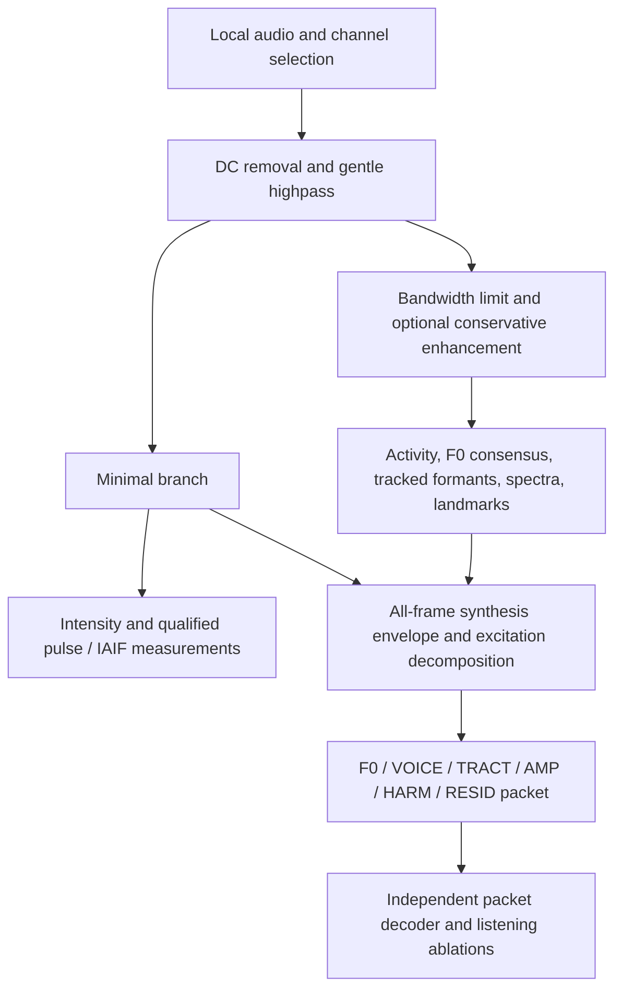

# Research recommendations and implementation coverage

The baseline is the supplied 24-page report,
[Deterministic Signal-Processing Methods for Extracting Human Voice Features from Audio](references/deterministic-voice-features.pdf).
The PDF metadata attributes it to **ChatGPT Deep Research**. It is retained
unchanged; see [reference provenance](references/README.md). This page maps its
recommendations to the actual implementation rather than reproducing its text.

## Organizing idea

The report recommends several complementary measurements, each constrained by
the recording's bandwidth, noise, and periodicity. Voice Lab keeps separate
minimal and filtered branches because noise enhancement can change the very
cycle timing and amplitude used to estimate jitter, shimmer, and source shape.

The six-stream packet and its decoder extend the report's measurement stack
into an explicit reconstruction experiment. They are separately specified in
[the analysis guide](voice_analysis.md); their fidelity is measured against the
minimal selected-channel waveform.

## Recommendation map

| Report recommendation | Implemented behavior | Qualification or adaptation |
|---|---|---|
| Decode/channel QA and preserve physical bandwidth | Selected energetic channel, native-rate/channel metadata, resampling and full-scale checks | Channel selection is not beamforming; resampling cannot restore lost bandwidth |
| Minimal and enhanced branches | DC removal/gentle highpass; separate lowpass plus optional Wiener/subtraction | Offline zero-phase processing; no real-time latency claim |
| Deterministic activity with several cues | Energy, periodicity, zero crossings, flatness, adaptive nonspeech statistics, hysteresis/duration rules | Activity is an acoustic proxy; no human-origin guarantee |
| Complementary F0 candidates and temporal consistency | Filtered ACF, YIN, SPTK SWIPE prime, cepstrum; agreement clusters, explicit unvoiced state, path tracking | Engineering Butterworth ACF filter, not Praat's exact filter; SWIPE prime rather than original SWIPE |
| Burg formants and uncertainty-aware continuity | Ceiling-relative resampling/pre-emphasis, Burg poles, spectral QA, ordered association, Kalman/RTS tracking | Hamming window/scalar tracker; not an exact Praat or KARMA reproduction; gaps remain missing |
| STFT, CQT, MFCC, spectral features | Actual transforms plus derivatives and spectral descriptors | CQT magnitudes are aligned from their native hop onto common frame times; padding is recorded |
| Prosody and broad acoustic landmarks | Relative intensity, pauses, bursts, voicing/frication transitions, vowel-like nuclei | Not phoneme recognition or verified syllable transcription |
| Qualified cycle perturbation | Acoustic pulse timing, jitter/shimmer and multi-cycle variants | Stable high-confidence intervals only; acoustic pulse maxima are not laryngograph closure marks |
| IAIF when defensible | Two-pass source/tract inverse filtering, flow/derivative playback, derived descriptors | Uncalibrated experimental source estimate; NAQ/open-phase/closure descriptors are proxies |
| Confidence, missingness, provenance | Parameters, bandwidth, estimator agreement, coverage, observed/tracked/rejected states | Abstention is explicit; plausible tracks do not establish measurement accuracy |
| Reference-bounded evaluation | Known synthetic source/filter annotations and optional independent CLI JSON references | Real imports have no automatically verified reference labels |
| Preserve information beyond voiced parameters | Dense complementary excitation remainder on every frame; packet-only synthesis | Added reconstruction contract; retains interference as well as human sounds |

## Minimal, filtered, and IAIF outputs

**Minimal** is the waveform-preserving measurement branch and full-packet
target. **Filtered/enhanced** is an estimator input; it may be easier to analyze
or listen to but can alter source-sensitive measurements. **IAIF source** tries
to undo the estimated vocal-tract/radiation contribution in qualified voiced
regions. It is not a clean extracted speaker track.

Qualification requires stable, sufficiently periodic phonation, estimator
agreement, adequate interval length, and a declared noise-floor energy margin.
That margin is an SNR proxy. Telephone, detected full-scale input, declared
synthetic reverb, known lossy codec paths, and codec fallback withhold pulse/source
outputs. When no interval qualifies, the UI hides IAIF playback and states why.

## Reconstruction and what it proves

TRACT uses a separate all-frame Burg synthesis envelope converted to LSFs.
HARM models normalized excitation harmonics. RESID stores what remains after
subtracting that model. The decoder adds HARM and RESID once, filters through
the decoded tract envelope, restores gain, and overlap-adds frames.

Full-packet reconstruction checks that the packet preserves its declared minimal
target and can decode independently. Complementary harmonic/residual playback
checks component accounting. Parameter-only playback replaces the dense
remainder with deterministic band-shaped noise; its quality is a different
question and is not established by full-packet error.

The packet is unquantized and includes dense waveform data. A 100-Hz parameter
timeline does not make it a compact codec, tokenizer, or low-bitrate embedding.
The regularized synthesis envelope is not validated anatomical tract shape.

## Outside the app's current scope

The report discusses condition-dependent methods and evaluation resources
beyond this local measurement/reconstruction application. The app does not
implement calibrated microphone-array beamforming, overlapping monaural speaker
separation, enrollment-based identity extraction, PSOLA pitch edits, DTW-based
alignment, or exact phonetic transcription. It does not automatically download
TIMIT, NTIMIT, PTDB-TUG, Hillenbrand, or their independent annotations.

Absolute SPL needs microphone calibration, and physiological claims need
independent validation. Corpus-level accuracy needs held-out references,
speaker/channel stratification, fixed adaptation rules, and error alongside
coverage. Generated controls and numerical reconstruction tests establish
controlled implementation behavior, not those research or clinical outcomes.

## Where to inspect the implementation

`recommended.py` implements the measurements, `representation.py` defines the
packet and decoder, `evaluation.py` handles reference scoring, and `dsp.py`
contains shared framing/candidate math. [Implementation decisions](implementation.md)
record deviations and their rationales. The PDF's citations remain inside the
original document; this application does not claim to reproduce their results.
